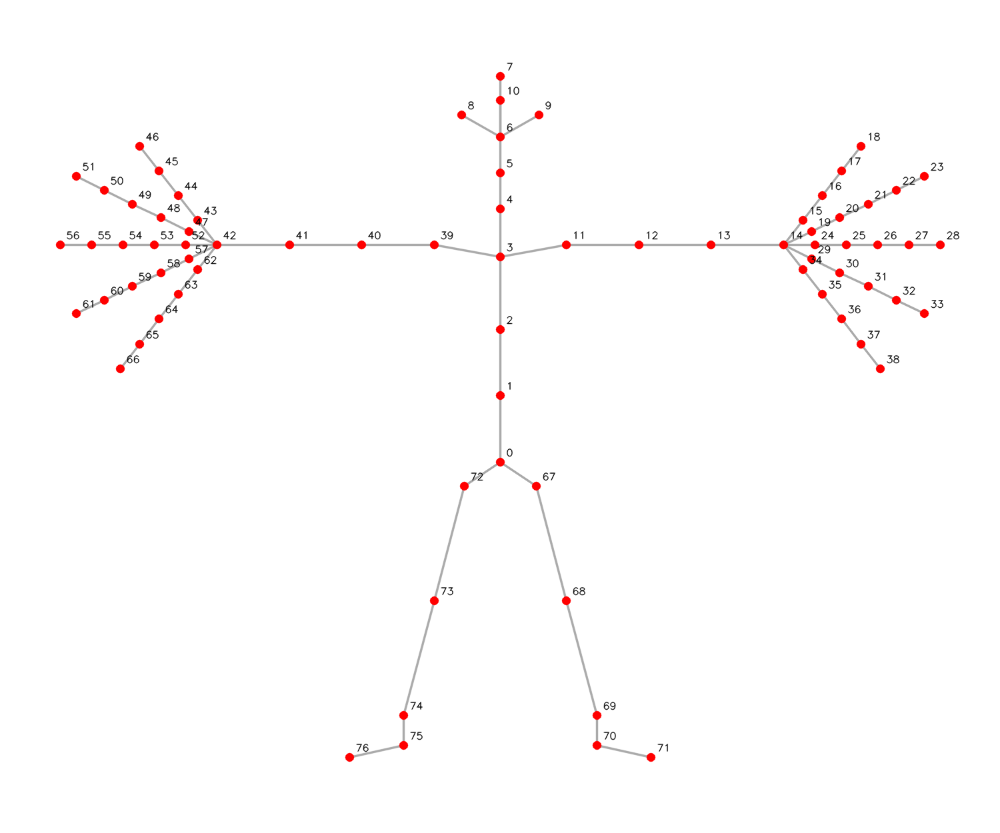

# NVIDIA 3D Body Pose NIM Client

This package has a sample client which demonstrates interaction with a 3D Body Pose NIM.

The client streams a compressed video file and a tracked bounding-box annotation to the service. The service decodes the video, estimates the 3D pose of every tracked body, and streams back per-frame 2D keypoints, 3D keypoints, joint rotations, rest pose and root pose on the 77-joint Nova skeleton. The client writes the poses to a JSON Lines file and can render a skeleton overlay onto the input video.

The service does **not** detect or track people: you supply the tracked boxes per frame.

## Pre-requisites

- Python 3.10 to 3.12. Refer to the [Python documentation](https://www.python.org/downloads/) for installation instructions.
- Access to NVIDIA 3D Body Pose NIM Container / Service.

## Usage guide

### 1. Clone the repository

```bash
git clone https://github.com/nvidia-maxine/nim-clients.git
cd nim-clients/body-pose
```

### 2. Install dependencies

```bash
pip install -r requirements.txt
```

### 3. Host the NIM Server

Set up the 3D Body Pose NIM server by following the [quick start guide](https://docs.nvidia.com/nim/maxine/body-pose/latest/index.html).

The first start downloads the model and can take several minutes. Wait until the server reports ready before running the client:

```bash
curl http://localhost:8000/v1/health/ready
```

### 4. Compile the Protos

If you want to use the client code provided in the GitHub client repository, you can skip this step.

The proto files are available in the `body-pose/protos` folder. You can compile them to generate client interfaces in your preferred programming language. For more details, refer to [Supported languages](https://grpc.io/docs/languages/) in the gRPC documentation.

The following example shows how to compile the protos for Python on Linux and Windows.

#### Python

The `grpcio` version needed for compilation can be referred at `requirements.txt`

**To compile protos on Linux:**
```bash
# Go to body-pose/protos/linux/ folder
cd body-pose/protos/linux/

chmod +x compile_protos.sh
./compile_protos.sh
```

**To compile protos on Windows:**
```bash
# Go to body-pose/protos/windows/ folder
cd body-pose/protos/windows/

./compile_protos.bat
```

The compiled proto files appear in the `nim-clients/body-pose/interfaces` directory.

### Supported Formats

#### Video

| Codec | Container |
|-------|-----------|
| H.264 (preferred), H.265, AV1, VP8, VP9 | MP4 (`.mp4`), WebM (`.webm`), Matroska (`.mkv`) |

The video must be 4:2:0 8-bit SDR with a **constant frame rate**. Boxes are matched to frames by frame index, so the server rejects variable frame rate input, HDR or 10/12-bit content, 4:2:2/4:4:4 chroma, and codecs the server GPU cannot decode with `INVALID_ARGUMENT`. Re-encode such a video with:

```bash
ffmpeg -i input.mov -c:v libx264 -pix_fmt yuv420p -fps_mode cfr output.mp4
```

#### Tracked Bounding Boxes

The annotation is a text file with one row per tracked body per frame:

```
<number_of_tracked_bodies>
<frame_id> <tracking_id> <x> <y> <width> <height>
<frame_id> <tracking_id> <x> <y> <width> <height>
...
```

- Line 1 is the number of tracked bodies, between 1 and 50.
- Boxes are in full-image pixels; `x`, `y` is the top-left corner. `frame_id` is the decoded frame index, starting at 0.
- A row of exactly `-1 -1 -1 -1` marks the body as absent in that frame and is skipped. Any other box with a non-positive width or height is malformed and the server rejects the request with `INVALID_ARGUMENT`, listing every offending row.
- At most 50 boxes per frame.

The sample `assets/sample_bbox.txt` tracks 15 bodies over the 300 frames of `assets/sample_video.mp4`.

### 5. Run the Python Client

```bash
cd scripts

python body_pose.py \
    --target 127.0.0.1:8001 \
    --video-input ../assets/sample_video.mp4 \
    --bbox-input ../assets/sample_bbox.txt \
    --output body_pose_output.json
```

To also render the skeleton overlay onto the input video:

```bash
python body_pose.py \
    --target 127.0.0.1:8001 \
    --video-input ../assets/sample_video.mp4 \
    --bbox-input ../assets/sample_bbox.txt \
    --output body_pose_output.json \
    --overlay-output body_pose_overlay.mp4
```

The overlay reproduces the AR SDK `BodyPose3DApp` sample: 2D keypoints in green, 3D keypoints reprojected with a pinhole camera in red, and per-track colored boxes with ID labels. Use `--draw-keypoints 2d` or `--draw-keypoints 3d` to draw only one set.

#### Invoking via NVCF API (Preview Mode)

To run inference against the NVIDIA Cloud Functions (NVCF) hosted service, use preview mode:

```bash
cd scripts

python body_pose.py --preview-mode \
    --target grpc.nvcf.nvidia.com:443 \
    --function-id <FUNCTION_ID> \
    --api-key <NVCF_API_KEY> \
    --video-input ../assets/sample_video.mp4 \
    --bbox-input ../assets/sample_bbox.txt
```

Replace `<FUNCTION_ID>` and `<NVCF_API_KEY>` with your assigned function ID and API key. In preview mode, the client connects over a secure gRPC channel to the NVCF endpoint.

### 6. Important Usage Notes

#### Delayed Outputs

Pose outputs are delayed. The model uses a temporal window, so the server buffers roughly 120 frames before it sends the first poses; the responses then arrive frame-aligned but behind the input. After the video ends the server drains its buffered frames and ends the stream.

Every stream opens with a service info banner the client prints before the poses: feature name and version, model, the request ID the server logs this stream under, and your `--client-session-id` echoed back. Quote the request ID in a support request.

#### Contact Correction

`--enable-contact` turns on static-camera contact correction, which runs inverse kinematics and is significantly slower. The container boots with it off.

This is a server-wide setting fixed when the server starts (`-e BODY_POSE_ENABLE_CONTACT=1` for on). A request asking for the other value is processed with the server's value, and the client prints a `Server warning:` line naming both. Send the request to a server started with the value you need; omit the flag to accept the server's value.

#### Errors

| Status | Meaning |
|--------|---------|
| `INVALID_ARGUMENT` | The video or the boxes were rejected; the details list every problem found. Fix them all before retrying. |
| `INTERNAL` | The server decoded fewer frames than the annotation covers, by a small margin. Compare the highest `frame_id` in the annotation with the real frame count of the video. |
| `RESOURCE_EXHAUSTED` | Every stream slot is busy. The server admits `NV_AI4M_MAX_CONCURRENCY_PER_GPU` streams per GPU (default 1); a request waiting longer than `BODY_POSE_REQUEST_ADMISSION_TIMEOUT_SEC` (default 15 s) is rejected. Serialize requests or raise the server concurrency. |
| `DEADLINE_EXCEEDED` | The client's `--timeout` expired. Raise it for long videos or many tracked bodies. |
| `UNAVAILABLE` | The server is not reachable or not ready yet. Check the health endpoint above, the `--target` port (8001 is gRPC, 8000 is HTTP), and `--ssl-mode`. |

When a stream fails or returns no pose after the output file was created, the client renames it to `<output>.partial` so it is not mistaken for a complete result.

#### Command Line Arguments

| Argument               | Description                                                                 | Default                          |
|------------------------|-----------------------------------------------------------------------------|----------------------------------|
| `--target`             | IP:port of gRPC service.                                                    | `127.0.0.1:8001`                 |
| `--video-input`        | Path to input video file (MP4, WebM or MKV).                                | `../assets/sample_video.mp4`     |
| `--bbox-input`         | Path to the tracked bounding-box annotation file (TXT).                     | `../assets/sample_bbox.txt`      |
| `--output`             | Path for the output pose file (JSON Lines).                                 | `body_pose_output.json`          |
| `--overlay-output`     | Path for the skeleton overlay video (MP4). No overlay when omitted.          | `None`                           |
| `--draw-keypoints`     | Keypoints drawn on the overlay: `2d`, `3d` or `both`.                       | `both`                           |
| `--focal-length`       | Pinhole focal length in pixels. `0` uses the default derived from the image size. | `0.0`                      |
| `--enable-contact`, `--no-enable-contact` | Request static-camera contact correction. See [Contact Correction](#contact-correction). | server setting |
| `--timeout`            | RPC deadline in seconds. `0` disables the deadline.                         | `3600.0`                         |
| `--client-session-id`  | Session identifier of your own (printable ASCII), echoed in the service info banner. | `None`                  |
| `--preview-mode`       | Send request to the preview NVCF NIM server.                                | `False`                          |
| `--api-key`            | NGC API key for authentication. Required in preview mode.                   | `None`                           |
| `--function-id`        | NVCF function ID for the service. Required in preview mode.                 | `None`                           |
| `--ssl-mode`           | SSL mode: `DISABLED`, `TLS`, or `MTLS`.                                     | `DISABLED`                       |
| `--ssl-key`            | Path to SSL private key (required for MTLS).                                | `../ssl_key/ssl_key_client.pem`  |
| `--ssl-cert`           | Path to SSL certificate chain (required for MTLS).                          | `../ssl_key/ssl_cert_client.pem` |
| `--ssl-root-cert`      | Path to SSL root certificate (required for TLS/MTLS).                       | `../ssl_key/ssl_ca_cert.pem`     |

#### Output Format

The output is JSON Lines: one object per frame, matching the `--out_json` output of the AR SDK sample app.

```json
{"frame_id": 0, "detections": [{"tracking_id": 1, "bbox": [x, y, w, h], "keypoints_2d": [[x, y], ...], "keypoints_confidence": [c, ...], "keypoints_3d": [[x, y, z], ...], "rest_pose": [[x, y, z], ...], "joint_rotations": [[x, y, z, w], ...], "root_pose": {"translation": [x, y, z], "rotation": [x, y, z, w]}}]}
```

| Field | Description |
|-------|-------------|
| `bbox` | The tracked box the pose was estimated from, in pixels. |
| `keypoints_2d` | Joint positions in image pixels. |
| `keypoints_confidence` | Per-joint confidence. |
| `keypoints_3d` | Joint positions in camera coordinates, meters. |
| `rest_pose` | Rest-pose joint positions, root-relative, meters. |
| `joint_rotations` | Local joint rotations relative to the rest pose, quaternions `(x, y, z, w)`. |
| `root_pose` | Root translation (meters) and rotation in camera coordinates. |

Per-joint arrays are all length 77, in the order of the Nova-77 skeleton:



#### Jupyter Notebook

For an interactive walkthrough, use [`notebook/body_pose_notebook.ipynb`](notebook/body_pose_notebook.ipynb). It runs pose estimation and the skeleton overlay on the sample clip.

Refer to the [docs](https://docs.nvidia.com/nim/maxine/body-pose/latest/index.html) for more information.
